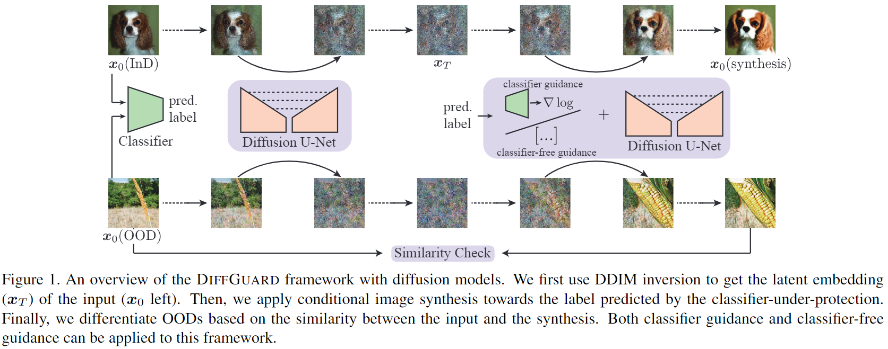

# DiffGuard

[](https://arxiv.org/abs/2308.07687)

This repository contains the implementation of the ICCV2023 paper:

> **DiffGuard: Semantic Mismatch-Guided Out-of-Distribution Detection using Pre-trained Diffusion Models** <br>
> Ruiyuan Gao<sup>$\dagger$</sup>, Chenchen Zhao<sup>$\dagger$</sup>, Lanqing Hong<sup>$\ddagger$</sup>, Qiang Xu<sup>$\dagger$</sup> <br>
> The Chinese University of Hong Kong<sup>$\dagger$</sup>, Huawei Noah’s Ark Lab<sup>$\ddagger$</sup>

Given a classifier, the inherent property of semantic Out-of-Distribution (OOD) samples is that their contents differ from all legal classes in terms of semantics, namely *semantic mismatch*. In this work, we propose to directly use pre-trained diffusion models for semantic mismatch-guided OOD detection, named DiffGuard. Specifically, given an OOD input image and the predicted label from the classifier, we try to enlarge the semantic difference between the reconstructed OOD image under these conditions and the original input image. We also present several test-time techniques to further strengthen such differences.

<div  align="center">    

</div>

## Getting Started

### Environment Setup

The code is tested with `Pytorch==1.10.2` and `torchvision==0.11.3`.
You should have these packages before starting. To install additional packages, follow:
```python
git clone --recursive https://github.com/cure-lab/DiffGuard.git

cd ${ROOT}
pip install -r requirements.txt

# install external
cd ${ROOT}/external
pip install -e taming-transformers
ln -s pytorch-grad-cam/pytorch_grad_cam

# install current project (i.e., guided-diffusion package)
cd ${ROOT}
pip install -e .
```

### Pretrained Weights

Since we use the pretrained diffusion models, all the pretrained weights can be downloaded from the corresponding open-sourced projects:

- GDM: 256x256 diffusion (not class conditional), [256x256_diffusion_uncond.pt](https://openaipublic.blob.core.windows.net/diffusion/jul-2021/256x256_diffusion_uncond.pt)
- LDM: LDM-VQ-8 on ImageNet, [cin.zip](https://ommer-lab.com/files/latent-diffusion/cin.zip)
- ResNet50 classifier: either from torchvision (ImageNet V1) or [OpenOOD](https://github.com/Jingkang50/OpenOOD)

We assume you put them at `${ROOT}/../pretrained/` as follows:
```bash
${ROOT}/../pretrained/
├── guided-diffusion
│   └── 256x256_diffusion_uncond.pt
├── ldm
│   └── cin256-v2
├── openood
│   └── imagenet_res50_acc76.10.pth
└── torch_cache (we change the default cache dir of torchvision)
    └── checkpoints
```
Note that, we change torch cache directory with
```python
torch.hub.set_dir("../pretrained/torch_cache")
```
in `testOOD/test_openood.py`. You can comment this line to use the default place.

### Datasets

This project use ImageNet benchmark following [OpenOOD](https://github.com/Jingkang50/OpenOOD). We assume the data directory locates at `${ROOT}/../data` as follow
```bash
${ROOT}/../data/
../data/
├── imagenet_1k
│   └── val
└── images_largescale
    ├── imagenet_o
    │   ├── n01443537
    │   └── ...
    ├── inaturalist
    │   └── images
    ├── openimage_o
    │   └── images
    └── species_sub
```

together with the image list files from OpenOOD:

```bash
${ROOT}/useful_data/
└── benchmark_imglist
    └── imagenet
        └── *.txt
```


## Run the Experiments

Our default log directory is `${ROOT}/../DiffGuard-log/`, with is outside of `${ROOT}`. Please be prepared.

All experiments can be started with `testOOD/start_job.py` with parse the override params from both `.yaml` files and command line. Check the example as follows to reproduce the results in Table.2 of our paper (only with DiffGuard):

- GDM with 8 GPUs (V100 32Gb, default config takes about 23Gb)
    ```bash
    python testOOD/start_job.py --overrides_file testOOD/exp/exp6.1.yaml \
        --world_size 8 [--init_method ... --task_index 6.1]
    ```
- LDM with 8 GPUs (V100 32Gb, default config takes about 20Gb)
    ```bash
    python testOOD/start_job.py --overrides_file testOOD/exp/ldm-exp2.25.yaml \
        --world_size 8 [--init_method ... --task_index 2.25]
    ```

We use `Hydra` to manage the configs. Using `testOOD/start_job.py` is similar to `testOOD/test_openood.py`. However, you need to parse the override parameters through command line to use the latter one.

Besides, we provides config to reproduce the results with oracle classifier, check configs in `testOOD/exp/oracle/*.yaml`

## Other Scripts & configs
- `testOOD/show_openood.py`: used for more visualizations
- `scripts_cls/*`: analyze the classifier-under-protect, as in Fig.2
- `testOOD/exp/oracle/*`: configs assuming an oracle classifier
- `testOOD/exp/speed/*`: used to test inference speed
-  `testOOD/exp/ablation/*`: for ablation study on GDM

## Cite Us

```bibtex
@inproceedings{gao2023diffguard,
  title={{DiffGuard}: Semantic Mismatch-Guided Out-of-Distribution Detection using Pre-trained Diffusion Models},
  author={Gao, Ruiyuan and Zhao, Chenchen and Hong, Lanqing and Xu, Qiang},
  booktitle={Proceedings of the IEEE/CVF International Conference on Computer Vision},
  year={2023}
}
```

## Credit

We thank following open-sourced projects:
- Our code use tools: [pytorch-grad-cam](https://github.com/jacobgil/pytorch-grad-cam) and [PyTorch Image Quality (PIQ)](https://github.com/photosynthesis-team/piq)
- Diffusion models from: [latent-diffusion](https://github.com/CompVis/latent-diffusion) (with [taming-transformers](https://github.com/CompVis/taming-transformers)) and [guided-diffusion](https://github.com/openai/guided-diffusion)
- CIFAR-10 and ImageNet Benchmark for OOD detection: [OpenOOD](https://github.com/Jingkang50/OpenOOD)
